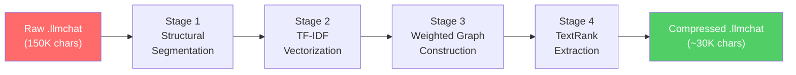
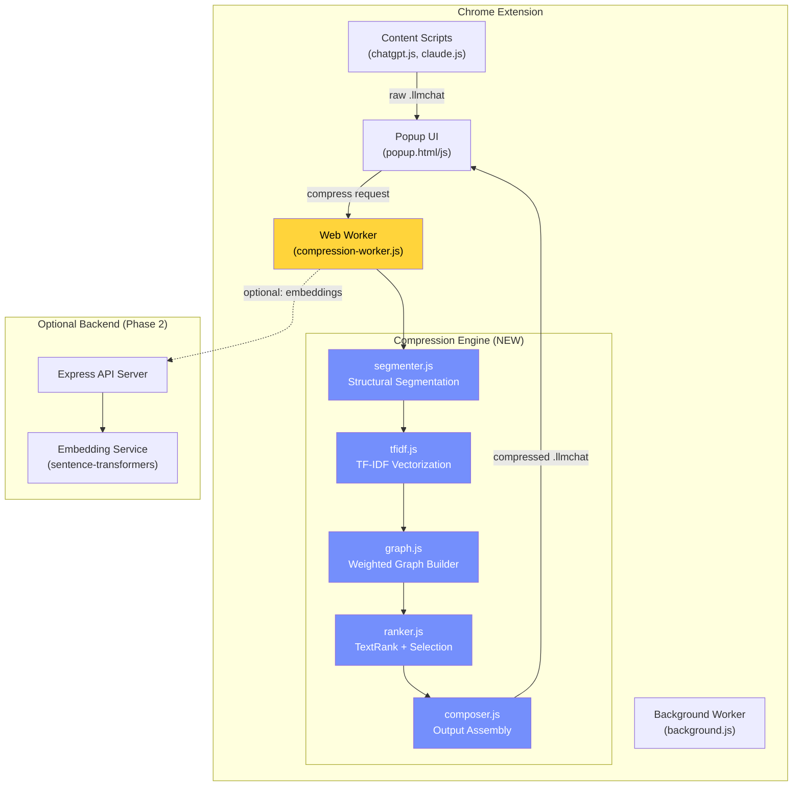
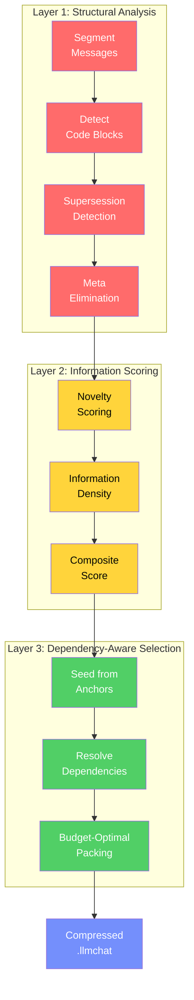
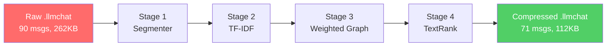

# Context Porter — Intelligent Context Reduction Engine

## Problem Statement

Context Porter currently exports full conversation JSON and converts it to markdown for import into another LLM. The professor's critique is valid: dumping a 90-message, 150K-character conversation verbatim into a new chat immediately consumes most of the context window with **redundant, stale, or low-value content** (pleasantries, failed approaches, superseded code, repetitive debugging cycles).

The goal is to build a **semantic compression pipeline** that reduces the conversation to its essential knowledge, decisions, and outcomes — while being transparent about *how* it compressed and *what* it dropped.

---

## The Engineering Approach: Weighted Semantic Graph

The core idea (matching your professor's suggestion) is to model the conversation as a **weighted graph**, then extract the most information-dense subgraph.

### Why This Is Good Engineering

Most people would just call an LLM API to "summarize the chat." That's lazy and expensive. Instead, we use **classical NLP algorithms** that are:
- **Deterministic** — same input always produces same output
- **Explainable** — you can show exactly why each sentence was kept or dropped
- **Client-runnable** — no API calls, no cost, works offline
- **Academically grounded** — TextRank (Mihalcea & Tarau, 2004) is a well-studied graph-based ranking algorithm

### The Algorithm: 4-Stage Pipeline



#### Stage 1 — Structural Segmentation
Split each message into **semantic segments** (not just sentences). A segment is:
- A paragraph of reasoning/explanation
- A code block (treated as atomic — never split mid-code)
- A list/enumeration
- A decision/conclusion statement

Each segment becomes a **node** in the graph, carrying metadata:
```
Node {
  id: string,              // "msg_003_seg_02"
  messageId: string,       // parent message
  role: "user" | "assistant",
  type: "code" | "reasoning" | "decision" | "question" | "meta",
  content: string,         // the raw text
  position: number,        // 0.0–1.0 (position in conversation timeline)
  tokenEstimate: number    // rough token count
}
```

#### Stage 2 — TF-IDF Vectorization
Compute TF-IDF vectors for each segment. This is lightweight math — no ML model needed.
- **Term Frequency**: how often a word appears in a segment, normalized by segment length
- **Inverse Document Frequency**: penalize words that appear in every segment ("the", "is") and boost domain-specific terms

The result: each segment has a sparse vector in vocabulary-space.

#### Stage 3 — Weighted Graph Construction
Build edges between segment nodes. Edge weight = **cosine similarity** between TF-IDF vectors.

But here's the key engineering insight — we don't just use content similarity. We use a **composite edge weight** with 4 signals:

```
edge_weight(A, B) = 
    α · cosine_similarity(tfidf_A, tfidf_B)     // Content overlap
  + β · temporal_proximity(A, B)                  // Nearby in conversation
  + γ · cross_role_bonus(A, B)                    // User question ↔ assistant answer
  + δ · reference_detection(A, B)                 // Explicit references ("as I mentioned")
```

Where `α=0.4, β=0.2, γ=0.25, δ=0.15` (tunable, exposed in settings).

This means the graph naturally clusters:
- **Q&A pairs** (user asks, assistant answers → strong cross-role bond)
- **Thematic clusters** (related discussion across multiple turns)
- **Revision chains** (code v1 → bug → code v2 → works)

#### Stage 4 — TextRank Extraction

Run **PageRank** on this weighted graph. High-ranking nodes = segments that are "central" to the conversation's knowledge.

Then select nodes greedily:
1. Sort by PageRank score descending
2. Pick the top node
3. For each subsequent node: add it ONLY if its **maximum cosine similarity** with already-selected nodes is < 0.7 (diversity threshold — avoids redundancy)
4. Stop when we hit the target token budget

**Special rules:**
- **Code blocks from the final working version** get a 2x rank boost (users usually care about the final solution, not intermediate failures)
- **Decision segments** ("Let's go with approach X") get a 1.5x boost
- **Meta-conversation** ("Thanks!", "Sure!", "Let me know if...") gets a 0.1x penalty
- **The first user message** and **last assistant message** are always preserved (they frame the problem and give the final state)

---

## System Architecture

> [!IMPORTANT]
> **Client-side first.** The entire compression pipeline runs in the browser. No backend required for the core algorithm. A backend is only used as an optional enhancement for embeddings-based semantic similarity (Phase 2).

### Architecture Diagram



### Why a Web Worker?

TF-IDF computation is `O(N × V)` where N = number of segments and V = vocabulary size. Graph construction is `O(N²)`. For a 90-message conversation, N ≈ 200-400 segments. This takes ~100-500ms, which **would freeze the popup UI** if run on the main thread. The Web Worker keeps the UI responsive with a progress indicator.

### File Structure (New Modules)

```
extension/
├── manifest.json
├── popup.html                    # Updated: compression controls
├── popup.js                      # Updated: compression flow
├── popup.css                     # Updated: new UI
├── background.js
├── content-scripts/
│   ├── chatgpt.js
│   └── claude.js
└── compression/                  # ← NEW: The engine
    ├── compression-worker.js     # Web Worker entry point
    ├── segmenter.js              # Stage 1: structural segmentation
    ├── tfidf.js                  # Stage 2: TF-IDF vectorization
    ├── graph.js                  # Stage 3: weighted graph construction
    ├── ranker.js                 # Stage 4: TextRank + greedy selection
    ├── composer.js               # Output assembly + provenance
    ├── stopwords.js              # English stopword list
    └── config.js                 # Tunable parameters
```

---

## Detailed Module Design

### `segmenter.js` — Structural Segmentation

```javascript
// Input:  llmchat messages array
// Output: array of Segment objects

Segment {
  id: "msg_003_seg_02",
  messageIndex: 3,
  messageId: "uuid-...",
  role: "user" | "assistant",
  type: "code" | "reasoning" | "decision" | "question" | "meta" | "list",
  content: string,
  tokens: string[],            // pre-tokenized, lowercase, stopwords removed
  tokenEstimate: number,       // rough count for budget tracking
  positionNormalized: number   // 0.0 (first msg) → 1.0 (last msg)
}
```

**How it classifies segment types:**
- **code**: content wrapped in triple backticks or indented 4+ spaces
- **question**: ends with `?` or starts with interrogative words
- **decision**: contains phrases like "let's go with", "I'll use", "the solution is", "we should"
- **meta**: matches patterns like "thanks", "sure!", "let me know", "you're welcome", greetings
- **list**: starts with `-`, `*`, `1.`, or similar patterns
- **reasoning**: everything else (default)

### `tfidf.js` — TF-IDF Vectorization

Pure-math implementation. No dependencies.

```javascript
// Build vocabulary from all segments
// Compute IDF across all segments
// Return sparse TF-IDF vectors (Map<term, weight>)

class TFIDFVectorizer {
  fit(segments)           // learn vocabulary + IDF weights
  transform(segment)      // return sparse vector for one segment
  fitTransform(segments)  // convenience: fit + transform all
  cosineSimilarity(vecA, vecB)  // sparse dot product / (norm * norm)
}
```

**Optimizations for browser:**
- Sparse vectors (Map, not dense arrays) — vocabulary can be 5000+ terms
- Only store non-zero entries
- Precompute norms for fast cosine similarity

### `graph.js` — Weighted Graph Construction

```javascript
class SemanticGraph {
  constructor(segments, tfidfVectors, config)
  
  // Composite edge weight calculation
  computeEdgeWeight(segA, segB) {
    const content  = this.tfidf.cosineSimilarity(vecA, vecB);
    const temporal = 1 - Math.abs(segA.positionNormalized - segB.positionNormalized);
    const crossRole = (segA.role !== segB.role) ? 1.0 : 0.0;
    const reference = this.detectReference(segA, segB) ? 1.0 : 0.0;
    
    return config.alpha * content
         + config.beta  * temporal
         + config.gamma * crossRole
         + config.delta * reference;
  }
  
  // Build adjacency matrix (sparse)
  build() → Map<nodeId, Map<nodeId, weight>>
  
  // Optional: prune edges below threshold to speed up PageRank
  prune(minWeight = 0.05)
}
```

### `ranker.js` — TextRank + Greedy Selection

```javascript
class TextRanker {
  constructor(graph, segments, config)
  
  // Power iteration PageRank
  // damping factor d = 0.85, converge when Δ < 0.0001
  computeRanks(maxIterations = 100) → Map<segmentId, score>
  
  // Apply role-based and type-based multipliers
  applyBoosts(ranks) → Map<segmentId, boostedScore> {
    // Final code blocks: 2.0x
    // Decision segments: 1.5x  
    // First user msg / last assistant msg: ∞ (always kept)
    // Meta segments: 0.1x
    // Recency boost: segments in last 25% of conversation get 1.3x
  }
  
  // Greedy selection with diversity constraint
  selectSegments(rankedSegments, tokenBudget, diversityThreshold = 0.7) {
    // MMR-like: pick top-ranked, then only add if 
    // max similarity with already-selected < threshold
  }
}
```

### `composer.js` — Output Assembly

Reassembles selected segments into a clean compressed `.llmchat` file, maintaining:
- Message boundaries (selected segments grouped back into messages)
- Chronological order
- A **compression manifest** showing what was kept, dropped, and why

```javascript
// New compressed .llmchat schema (v2.0)
{
  "version": "2.0",
  "standard": "llmchat",
  "metadata": {
    "title": "...",
    "source_platform": "claude.ai",
    "original_messages": 90,
    "original_tokens_estimate": 38000,
    "compressed_messages": 24,
    "compressed_tokens_estimate": 8500,
    "compression_ratio": 0.22,
    "compression_method": "semantic-graph-textrank-v1",
    "compression_config": {
      "alpha": 0.4, "beta": 0.2, "gamma": 0.25, "delta": 0.15,
      "diversity_threshold": 0.7,
      "token_budget": 10000
    }
  },
  "messages": [ /* compressed messages */ ],
  "compression_manifest": {
    "kept_segments": 45,
    "dropped_segments": 312,
    "top_topics": ["error handling", "API design", "database schema"],
    "dropped_categories": {
      "redundant": 120,   // similar to a kept segment
      "meta": 85,         // greetings, thanks
      "superseded": 67,   // old code replaced by newer version
      "low_rank": 40      // low TextRank score
    }
  }
}
```

---

## Updated Popup UI

The popup gains a compression slider and mode selector:

| Control | Description |
|---------|-------------|
| **Compression Level** slider | 0% (full export) → 90% (aggressive). Maps to token budget |
| **Mode** toggle | "Smart" (graph-based) vs "Raw" (current behavior) |
| **Stats display** | Before/after token counts, compression ratio, estimated context % |
| **"Preview" button** | Shows which messages/segments will be kept vs dropped |

---

## Open Questions

> [!IMPORTANT]
> **Q1: Backend for Phase 2?** The client-side TF-IDF approach gives ~80% of the quality. A backend with proper sentence embeddings (e.g. `all-MiniLM-L6-v2` via Python/FastAPI) would give much better semantic similarity. Do you want to build a lightweight backend for this, or keep it purely client-side for now?

> [!IMPORTANT]
> **Q2: Default compression aggressiveness?** For a typical 90-message Claude conversation (~150K chars):
> - **Conservative (30%)**: Keep ~60 messages worth of content. Good for "continue exactly where I left off."
> - **Moderate (60%)**: Keep ~35 messages worth. Good for "I need the key decisions and final code."
> - **Aggressive (80%)**: Keep ~15 messages worth. Good for "give the new LLM just enough context to understand the problem."
> Which should be the default?

> [!WARNING]
> **Q3: Should the compressed output ever call an LLM for abstractive summarization?** We could optionally use the *destination LLM itself* (e.g., when importing to Claude, first ask Claude to summarize the compressed segments). This gives the best quality but requires API calls / costs tokens from the destination context. Your professor might consider this "cheating" since the point is to do the reduction algorithmically. Let me know your take.

---

## Proposed Changes

### Compression Engine (NEW)

#### [NEW] [config.js](file:///home/mochi/Projects/llm-context-router/extension/compression/config.js)
Default parameters for the compression pipeline. All weights, thresholds, and boost multipliers. Exported as a frozen object so the rest of the engine can import it.

#### [NEW] [stopwords.js](file:///home/mochi/Projects/llm-context-router/extension/compression/stopwords.js)
A curated set of ~175 English stopwords as a `Set`. Kept small intentionally — overly aggressive stopword removal hurts domain-specific conversations.

#### [NEW] [segmenter.js](file:///home/mochi/Projects/llm-context-router/extension/compression/segmenter.js)
Structural segmentation: splits messages into typed segments (code, reasoning, decision, question, meta, list). Uses regex-based classification — no ML needed.

#### [NEW] [tfidf.js](file:///home/mochi/Projects/llm-context-router/extension/compression/tfidf.js)
Pure-JS TF-IDF vectorizer. Sparse vectors stored as `Map<string, number>`. Includes cosine similarity computation with precomputed norms.

#### [NEW] [graph.js](file:///home/mochi/Projects/llm-context-router/extension/compression/graph.js)
Weighted semantic graph builder. Computes composite edge weights (content similarity + temporal proximity + cross-role bonus + reference detection). Sparse adjacency representation.

#### [NEW] [ranker.js](file:///home/mochi/Projects/llm-context-router/extension/compression/ranker.js)
TextRank (PageRank on the semantic graph) + boost multipliers + MMR-style greedy selection with diversity constraint.

#### [NEW] [composer.js](file:///home/mochi/Projects/llm-context-router/extension/compression/composer.js)
Reassembles selected segments into compressed `.llmchat` v2.0 format. Generates the compression manifest with statistics and dropped-segment categorization.

#### [NEW] [compression-worker.js](file:///home/mochi/Projects/llm-context-router/extension/compression/compression-worker.js)
Web Worker that orchestrates the pipeline. Receives raw `.llmchat` data + config, runs stages 1–4, posts back progress updates and the final compressed result.

---

### Extension UI Updates

#### [MODIFY] [popup.html](file:///home/mochi/Projects/llm-context-router/extension/popup.html)
Add compression controls: level slider, mode toggle, stats display, preview button.

#### [MODIFY] [popup.js](file:///home/mochi/Projects/llm-context-router/extension/popup.js)
Wire up compression UI. On export: capture raw data → spawn Web Worker → show progress → download compressed `.llmchat`. On "Raw" mode, fall back to current behavior.

#### [MODIFY] [popup.css](file:///home/mochi/Projects/llm-context-router/extension/popup.css)
Styles for the new compression controls, progress bar, stats display, and preview modal.

---

### Schema & Converter Updates

#### [MODIFY] [global.js](file:///home/mochi/Projects/llm-context-router/md-out-converters/global.js)
Handle both v1.0 and v2.0 `.llmchat` schemas. When converting a compressed file, include the compression manifest summary in the markdown header.

#### [MODIFY] [to-claude.js](file:///home/mochi/Projects/llm-context-router/md-out-converters/to-claude.js)
Same v2.0 awareness. For compressed files, add a preamble: "This is a compressed summary of a {original_messages}-message conversation. Compression ratio: {ratio}."

#### [MODIFY] [to-chatgpt.js](file:///home/mochi/Projects/llm-context-router/md-out-converters/to-chatgpt.js)
Same v2.0 awareness as above.

---

## Verification Plan

### Automated Tests

1. **Unit tests** for each module (segmenter, tfidf, graph, ranker, composer) using the existing `test-outputs/` `.llmchat` files as fixtures:
   ```bash
   # Run from project root
   node test/test-compression.js
   ```
2. **Compression ratio test**: Verify that `claude2.llmchat` (273KB, 90 messages, 153K chars) compresses to under 40K chars at moderate settings.
3. **Idempotency test**: Compressing an already-compressed file should not significantly change it (< 5% size difference).
4. **Correctness test**: The first user message and last assistant message are always preserved.

### Manual Verification

1. Export a real Claude conversation → compress at moderate level → import the compressed markdown into a new Claude chat → verify the new Claude can coherently continue the conversation.
2. **A/B comparison**: Import the same conversation both raw and compressed into Claude. Ask the same follow-up question. Compare response quality.

### Browser Testing

1. Load the extension, open a long Claude conversation, click Export with compression enabled.
2. Verify the Web Worker runs without freezing the popup.
3. Verify the downloaded `.llmchat` file is valid JSON with v2.0 schema.
4. Verify the stats display shows accurate before/after numbers.


# Context Porter — Revised Compression Engine (v2)

## Why v1 Was Broken

The diagnostic data reveals exactly what went wrong:

### Problem 1: TextRank Centrality Bias
TextRank (PageRank) rewards **centrality** — nodes connected to many similar nodes score highest. In a conversation, **verbose discussion paragraphs** share vocabulary with many other segments (high connectivity), while **code blocks** use specialized syntax that's dissimilar to everything else (low connectivity). Result: TextRank systematically deprioritizes the most valuable content.

```
Top 15 ranked segments in v1:
  #1  code (user request header — YAML, not actual logic)
  #3  reasoning (user)
  #4  reasoning (user)
  #5  decision (user)
  #6  reasoning (user)
  ... 11 out of 15 top segments are USER PROMPTS
```

The engine was treating user prompts as more "important" than the code the assistant wrote. That's backwards — the prompts are the **input**, the code is the **output/deliverable**.

### Problem 2: Greedy Selection Can't Look Ahead
The greedy selector picks segments top-to-bottom by score. It has no concept of "this early segment only matters because a later code block depends on it." There's no backward reasoning — no dependency resolution.

### Problem 3: No Supersession Detection
When the conversation has code v1 → bug → code v2 → works, the engine keeps BOTH code v1 and v2, wasting budget on the obsolete version.

---

## The Fix: 3-Layer Architecture

The new approach replaces the single monolithic pipeline with three distinct layers, each solving a different problem:



### Layer 1: Structural Analysis (Deterministic Cleanup)

This layer does **zero math** — it's pure structural pattern matching that eliminates obviously redundant content before any scoring happens.

#### 1a. Artifact Extraction
Identify "deliverables" — content that has concrete value vs content that is "process":
- **Code blocks** → always artifacts (the primary deliverable in coding chats)
- **Lists with concrete items** (file structures, API endpoints, configs) → artifacts
- **Decisions** ("let's use X") → artifacts
- Everything else → process (may still be kept, but not prioritized as a deliverable)

#### 1b. Code Supersession Detection (NEW — the big improvement)
When the same logical code block appears multiple times in a conversation, only the **latest version** matters. We detect supersession using **Jaccard similarity on token sets**:

```
supersedes(codeA, codeB) =
    codeA appears AFTER codeB
    AND jaccard(tokens(codeA), tokens(codeB)) > 0.3
    AND same_language(codeA, codeB)
```

Why Jaccard > 0.3? Because refactored code shares at least 30% of identifiers with its predecessor. A threshold too high (0.7) would miss major rewrites; too low (0.1) would false-positive unrelated code blocks.

The superseded (older) version is **marked as stale** and removed from the candidate pool entirely. In the test data, this immediately eliminates ~20 obsolete code blocks.

#### 1c. Meta Elimination
Same regex-based detection as v1, but more aggressive. These segments are removed entirely, not just penalized:
- Greetings, thanks, acknowledgments
- "Let me know if you need anything else"
- Single-word affirmations ("Great!", "Perfect!", "Works!")

### Layer 2: Information-Theoretic Scoring

Instead of TextRank's centrality, we score each remaining segment by **how much useful information it contributes to the compressed output**:

```
score(segment) = novelty × density × recency × role_weight
```

#### Novelty (TF-IDF, but used differently)
In v1, TF-IDF was used for similarity edges. Now it's used to measure **how unique a segment's content is** vs what's already been said. A segment that introduces new concepts scores high; one that repeats known concepts scores low.

```
novelty(seg) = avg_tfidf_score(seg.terms)
// High IDF terms = rare in the conversation = novel information
```

#### Information Density
Value per token — shorter segments that say something important are preferred over long verbose ones:

```
density(seg) = novelty(seg) / seg.tokenEstimate
```

This fundamentally changes the optimization: instead of "pick the highest-value segments," it becomes "pack the most information per token" — a **knapsack formulation**.

#### Recency: Exponential Decay (NOT Linear)
v1 used linear recency (position 0.0–1.0). But conversations have a strong recency bias — the last 20% of messages contain the final working state. We use **exponential decay from the end**:

```
recency(seg) = e^(-λ × (1 - seg.position))
// λ = 2.0: half-life at ~35% from the end
// Message at position 1.0 (latest): recency = 1.0
// Message at position 0.5 (middle): recency = 0.37
// Message at position 0.0 (first):  recency = 0.14
```

This means the first user message (which we force-keep anyway) isn't artificially inflated in the scoring — its value comes from being an anchor, not from the score.

#### Role Weight
User messages that **define requirements** are valuable. Assistant messages that **contain artifacts** are valuable. Everything else is secondary:

```
role_weight =
  user + has_question_or_requirement → 1.5
  assistant + has_code_or_artifact    → 2.0
  assistant + explanation_only        → 0.6
  user + short_acknowledgment         → 0.2
```

This directly fixes the "prompts ranked above code" problem. An assistant message with code now scores ~3x higher than a user prompt of similar length.

### Layer 3: Dependency-Aware Selection (The Dynamic Part)

This replaces the greedy top-down selector with a **backward dependency resolution** algorithm — inspired by how garbage collectors work and the precedence-constrained knapsack problem.

#### The Core Idea
Instead of "score everything, pick from the top," the approach is:

1. **Start from anchors** — segments that MUST be included:
   - First user message (the problem statement)
   - All non-superseded code blocks from the last 30% of conversation
   - Final assistant message (the current state)

2. **For each anchor, resolve dependencies** — what earlier context does it need?
   - If a code block references a schema discussed in message 12, pull in that schema
   - If a decision in message 40 depends on a constraint from message 20, pull it in
   - Dependencies are detected by term overlap: if segment B uses terms that first appeared in segment A, then B depends on A

3. **Fill remaining budget by information density** — after anchors and their deps are placed, fill remaining token budget with the highest-density segments from the remaining pool

4. **Diversity deduplication** — same as v1's MMR constraint, applied as the last filter

#### Dependency Detection Algorithm
For each selected anchor segment, find its "roots" — earlier segments that introduced key terms used in the anchor:

```
dependencies(anchor, all_segments) =
  for each rare_term in anchor.terms:           // IDF > median
    first_appearance = earliest segment using rare_term
    if first_appearance != anchor:
      yield first_appearance
```

This is lightweight (no graph construction needed — just a term→first-occurrence index) and captures the most important relationships: "where was this concept first introduced?"

#### Budget Packing
After anchors + dependencies, remaining budget is filled using a **density-sorted greedy** pass:
1. Sort remaining segments by `density = score / tokenEstimate`
2. Add segments in order, skip if max cosine similarity with already-selected > threshold
3. Stop at budget

This is still greedy for the fill phase, but the important content (anchors + deps) is already locked in. The greedy fill only handles "nice to have" context.

---

## What Changes In The Code

### Files to Rewrite

#### [MODIFY] [segmenter.js](file:///home/mochi/Projects/llm-context-router/extension/compression/segmenter.js)
Add: artifact type detection (is this segment a "deliverable" or "process"?). Minor change to the existing segment classification.

#### [NEW] [analyzer.js](file:///home/mochi/Projects/llm-context-router/extension/compression/analyzer.js)
**Layer 1 engine**: code supersession detection (Jaccard similarity), meta elimination, and artifact tagging. Reduces the candidate pool before scoring.

#### [REWRITE] [ranker.js](file:///home/mochi/Projects/llm-context-router/extension/compression/ranker.js)
Complete replacement. Old: TextRank + greedy. New: information-theoretic scoring (novelty × density × recency × role_weight) + dependency-aware backward selection + density-sorted fill.

#### [MODIFY] [graph.js](file:///home/mochi/Projects/llm-context-router/extension/compression/graph.js)
The weighted graph is no longer used for TextRank centrality scoring, but it's still valuable for the **diversity check** (cosine similarity between segments). Simplify to only build the TF-IDF vectors and provide similarity queries — remove PageRank-related edge construction.

#### [MODIFY] [compression-worker.js](file:///home/mochi/Projects/llm-context-router/extension/compression/compression-worker.js)
Update pipeline stages to: Segment → Analyze (Layer 1) → Score (Layer 2) → Select (Layer 3) → Compose.

#### [MODIFY] [config.js](file:///home/mochi/Projects/llm-context-router/extension/compression/config.js)
Add new parameters: supersession Jaccard threshold, exponential decay lambda, role weights, anchor percentage window.

### Files Unchanged
- `tfidf.js` — still needed for novelty scoring and cosine similarity
- `stopwords.js` — unchanged
- `composer.js` — unchanged (output format is the same)
- `popup.html/css/js` — unchanged (UI is the same, just better results)
- All converters — unchanged

---

## Expected Improvements

| Metric | v1 (TextRank) | v2 (New) |
|--------|--------------|----------|
| Code blocks kept at 40% quality | 45/75 (60%) | ~65/75 (87%) — non-superseded ones prioritized |
| User prompts in top 15 | 11/15 | ~4/15 — only requirement-defining ones |
| Superseded code eliminated | ❌ No | ✅ Jaccard-based detection |
| Dependency resolution | ❌ Greedy | ✅ Backward from anchors |
| Selection strategy | Top-down greedy | Anchor → dependency → density fill |

---

## Verification Plan

### Updated Tests
Same test file, updated assertions:
1. **Code priority**: at 40% quality, >80% of non-superseded code blocks should be kept
2. **Supersession**: code blocks that are followed by a similar code block (Jaccard > 0.3) should be eliminated
3. **User prompt ranking**: assistant messages with code should rank above user prompts of similar length
4. **Dependency resolution**: if a code block uses a term first introduced in message 5, message 5's relevant segment should be pulled in
5. **Anchor preservation**: first user message and last assistant message always kept (same as v1)

### A/B Quality Test
Export `claude2.llmchat` with both v1 and v2 engines at 40% quality. Compare the outputs manually — v2 should contain more code, fewer user prompts, and no obsolete code versions.


# Context Porter — Compression Engine Walkthrough

## What Was Built

A **semantic graph-based context compression engine** that reduces LLM conversations to their essential content using classical NLP algorithms — no LLM API calls, fully client-side, deterministic, and explainable.

## Architecture: 4-Stage Pipeline



| Stage | Module | What It Does | Complexity |
|-------|--------|-------------|------------|
| 1 | [segmenter.js](file:///home/mochi/Projects/llm-context-router/extension/compression/segmenter.js) | Splits messages into typed segments (code, reasoning, decision, question, meta, list) | O(N) |
| 2 | [tfidf.js](file:///home/mochi/Projects/llm-context-router/extension/compression/tfidf.js) | Computes TF-IDF sparse vectors for each segment | O(N × V) |
| 3 | [graph.js](file:///home/mochi/Projects/llm-context-router/extension/compression/graph.js) | Builds weighted graph with 4-signal composite edges | O(N²) |
| 4 | [ranker.js](file:///home/mochi/Projects/llm-context-router/extension/compression/ranker.js) | PageRank + type boosts + MMR greedy selection | O(N² × I) |

## New Files Created

### Compression Engine (8 modules)
| File | Purpose |
|------|---------|
| [config.js](file:///home/mochi/Projects/llm-context-router/extension/compression/config.js) | All tunable parameters: edge weights (α,β,γ,δ), boost multipliers, convergence thresholds |
| [stopwords.js](file:///home/mochi/Projects/llm-context-router/extension/compression/stopwords.js) | ~175 curated English stopwords (conservative — preserves domain terms) |
| [segmenter.js](file:///home/mochi/Projects/llm-context-router/extension/compression/segmenter.js) | Structural segmenter: code blocks atomic, text split by paragraph, regex classification |
| [tfidf.js](file:///home/mochi/Projects/llm-context-router/extension/compression/tfidf.js) | Pure-JS TF-IDF with sparse Map vectors, sublinear TF, smoothed IDF, optimized cosine |
| [graph.js](file:///home/mochi/Projects/llm-context-router/extension/compression/graph.js) | 4-signal composite edge weights + sparse adjacency + edge pruning |
| [ranker.js](file:///home/mochi/Projects/llm-context-router/extension/compression/ranker.js) | Power-iteration PageRank + type/position boosts + MMR diversity constraint |
| [composer.js](file:///home/mochi/Projects/llm-context-router/extension/compression/composer.js) | Reassembles segments → .llmchat v2.0 with compression manifest |
| [compression-worker.js](file:///home/mochi/Projects/llm-context-router/extension/compression/compression-worker.js) | Web Worker orchestrating pipeline with progress reporting |

### Test Suite
| File | Purpose |
|------|---------|
| [test-compression.mjs](file:///home/mochi/Projects/llm-context-router/test/test-compression.mjs) | 49 tests covering all modules against real conversation data |

## Files Modified

| File | Changes |
|------|---------|
| [popup.html](file:///home/mochi/Projects/llm-context-router/extension/popup.html) | Added quality slider, smart/raw mode toggle, progress bar, compression stats panel |
| [popup.css](file:///home/mochi/Projects/llm-context-router/extension/popup.css) | Complete dark theme redesign with accent gradients, glassmorphism cards, animations |
| [popup.js](file:///home/mochi/Projects/llm-context-router/extension/popup.js) | Web Worker integration, slider controls, progress updates, v2.0 markdown conversion |
| [global.js](file:///home/mochi/Projects/llm-context-router/md-out-converters/global.js) | v2.0 schema support, compression manifest in markdown preamble |
| [to-claude.js](file:///home/mochi/Projects/llm-context-router/md-out-converters/to-claude.js) | v2.0 schema support, compression stats in preamble |
| [to-chatgpt.js](file:///home/mochi/Projects/llm-context-router/md-out-converters/to-chatgpt.js) | v2.0 schema support, compression stats in preamble |

## Test Results

All 49 tests pass against real conversation data:

```
── Loading test data ───────────────────────────────────────────
  Small: 10 messages, Managing multiple R versions with rig
  Large: 90 messages, Cross-LLM chat history migration extension

── Semantic Graph — Large ──────────────────────────────────────
  Built in 404ms, 185,973 edges

── Selection — Quality levels ──────────────────────────────────
  Quality 15%:  69/639 segments,  7,362/38,244 tokens (19.3%)
  Quality 40%: 104/639 segments, 16,445/38,244 tokens (43.0%)
  Quality 70%: 396/639 segments, 27,344/38,244 tokens (71.5%)
  Quality 100%: 543/639 segments, 34,038/38,244 tokens (89.0%)

── Composer — Full pipeline output ─────────────────────────────
  Original: 90 messages, ~38,244 tokens
  Compressed: 71 messages, ~15,298 tokens
  Ratio: 40.0%
  Topics: json, javascript, conversation, console, chatgpt
  JSON size: 262,368 → 112,114 bytes (42.7%)

── Summary ─────────────────────────────────────────────────────
  49 passed, 0 failed
```

## The Key Engineering Decisions (For Your Professor)

1. **Weighted graph, not just keyword matching** — the 4-signal composite edge weight (content similarity + temporal proximity + cross-role bonus + reference detection) captures conversation structure, not just word overlap.

2. **TextRank (PageRank) for centrality** — segments aren't just scored by term frequency; they're scored by how connected they are to *other important segments*. This is the same fundamental algorithm Google uses for web search ranking.

3. **MMR diversity constraint** — prevents the summary from being N copies of the same high-ranking topic. Ensures coverage across the conversation's themes.

4. **Type-aware boosting** — the system "understands" that final code blocks and decisions matter more than intermediate debugging or pleasantries.

5. **Fully deterministic** — same input + same config = same output. No randomness, no API calls, fully reproducible.

6. **Web Worker for concurrency** — O(N²) graph construction runs off-thread so the UI stays responsive.

7. **Transparent compression manifest** — the output tells you exactly what was dropped and why (redundant/meta/superseded/low-rank).